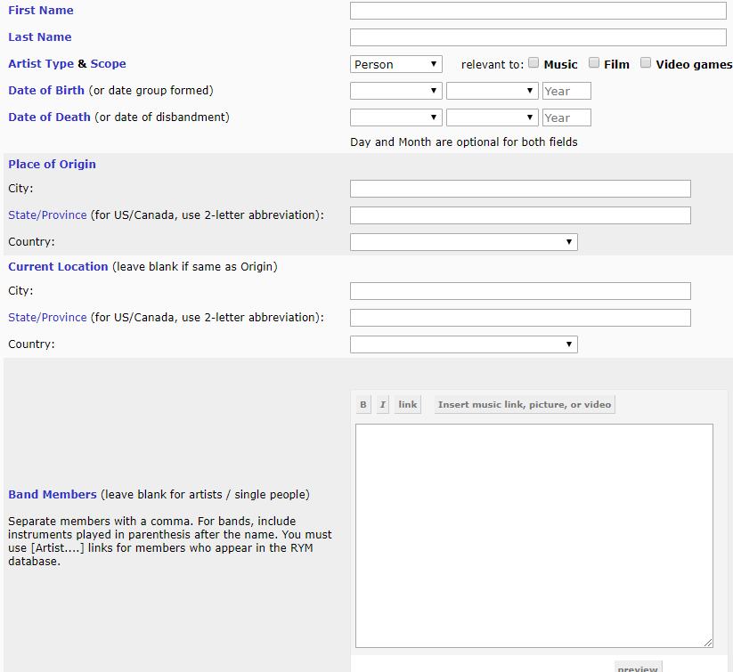
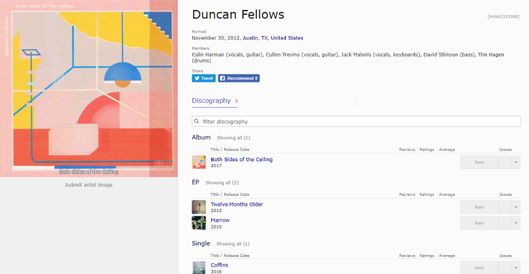

```{r setup, include=FALSE}
knitr::opts_chunk$set(echo = FALSE)
```

## Introduction to Rate Your Music (RYM)  

* Collaborative database that focuses on music and film    

* Entries are primarily created by volunteers    

* Anyone with a free account can create, improve, and moderate entries    

<center></center>

## Contribution Goals    

* Creating and detailing new entries for Austin musicians and their albums

* Gain a better understanding of how the website runs overall 

* Learn the process of content moderation

## Preparation 

* Set up a free account

* Find missing artists in the RYM database

* Read over RYM's wiki on adding artists

* Gather sources to verify information

## Contribution    

* Submitted three artist profiles along with their respective catalog of releases

* Adjust to database jargon

* Regularly reference RYM's various wikis


## Contribution  

 
## Submission Review  

* Appraisal of my entry for its accuracy and adherence to the database's guidelines

* Voting "yes" or "no"

* Approved either when three community members vote "yes" or a single moderator votes "yes"

* Reviewers can add comments to the submission post to point out errors or suggest improvements

## Submission Review  


## Approved Submission  



## Conclusion  

* Successfully contributed information on Austin musicians to the database

* Learned the behind-the-scenes moderation process

* Learned the rules and regulations of contributing