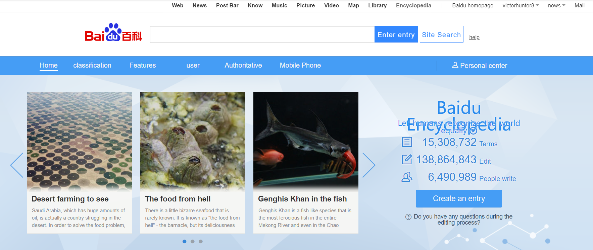

```{r setup, include=FALSE}
knitr::opts_chunk$set(echo = FALSE)
```

***
## Introduction ##
Baidupedia is an open source platform and community for all of the users to edit and make changes for a specific topic and key word. I will show how I participated this community.


***

## Steps ##
1. Find a topic I am familiar with
2. Target the topic that needs corrections
3. Edit and wait for feedback
     

***


***
## Result ##
  


