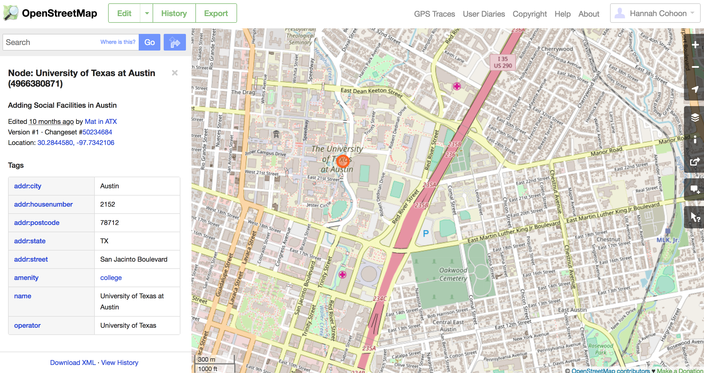
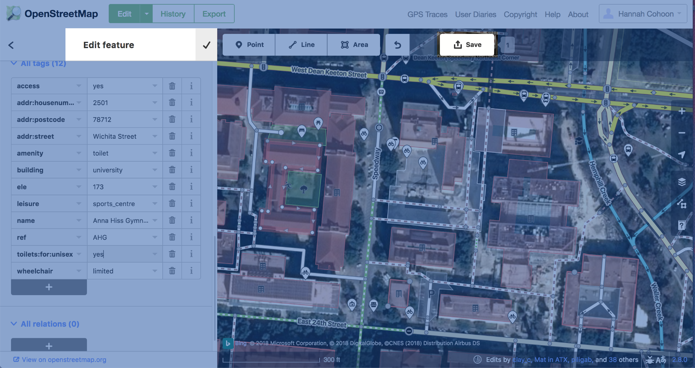
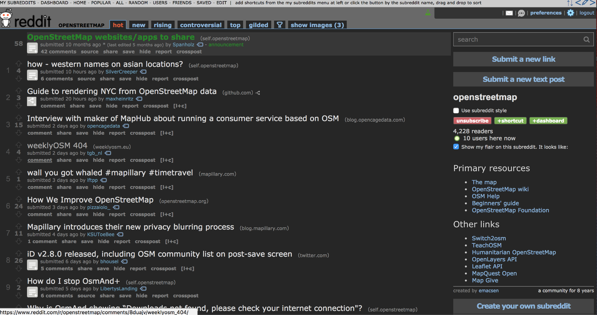
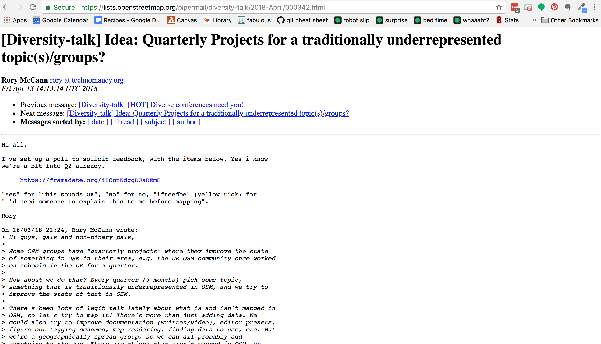
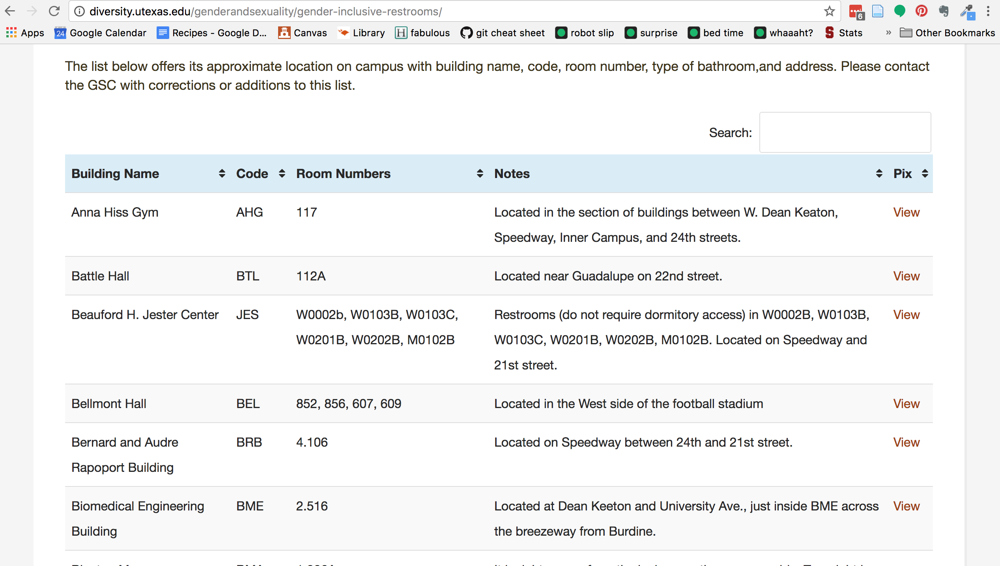
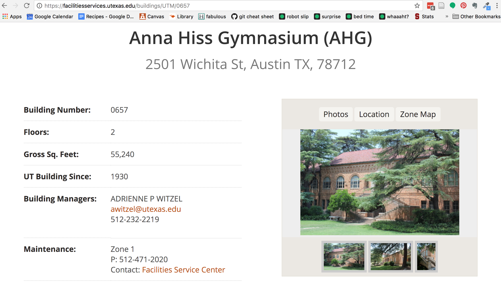
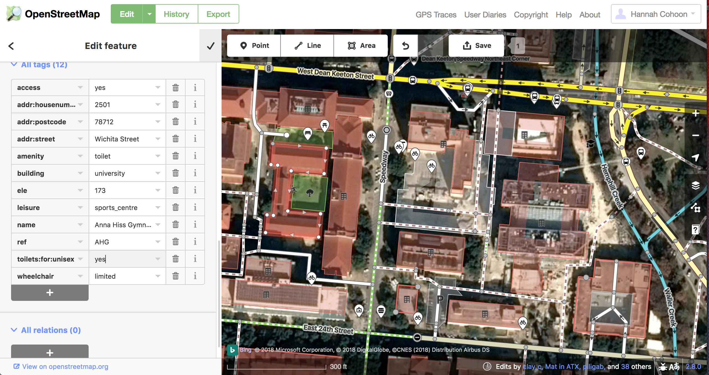
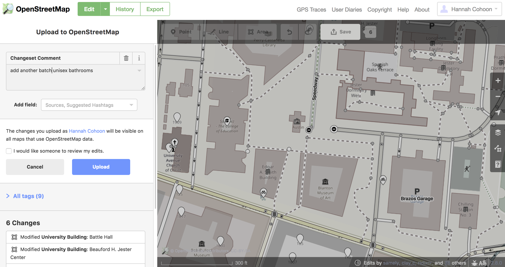
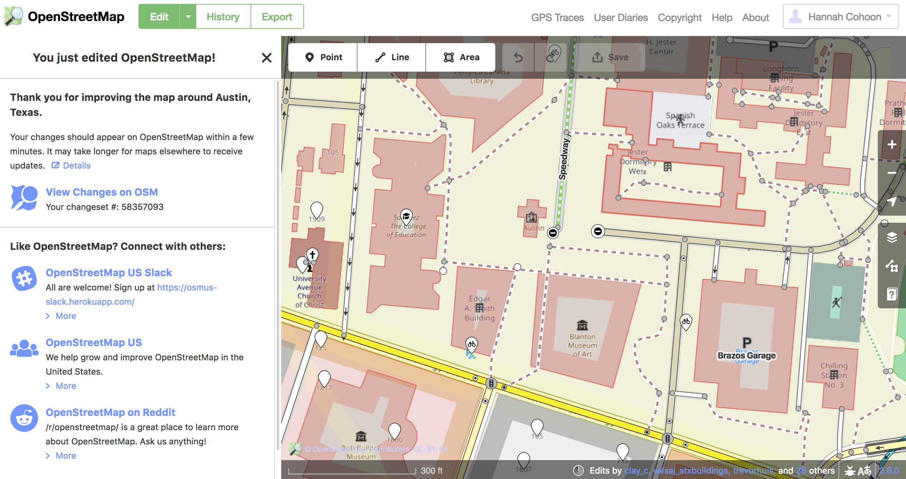
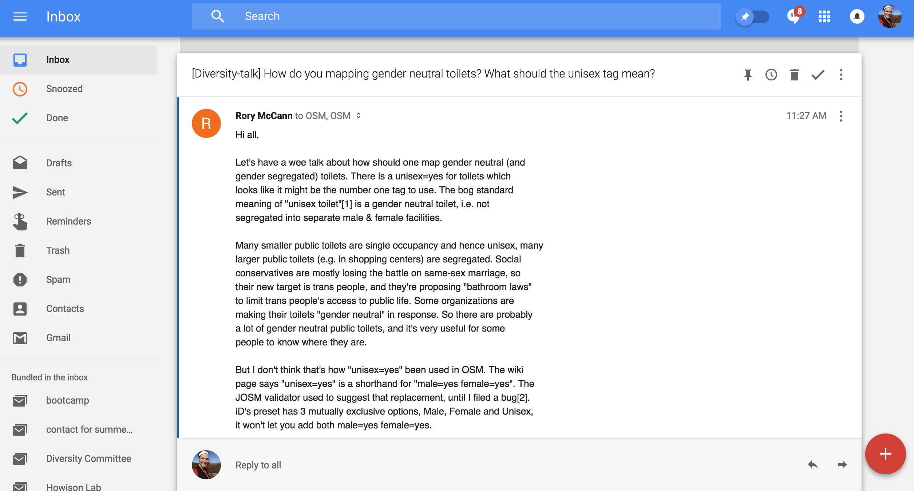

```{r setup, include=FALSE}
knitr::opts_chunk$set(echo = FALSE)
```

## Map Anything {.largeFont .centered}
> Any building or feature from the real world can be mapped in Open Street Map

## Map Anything

```{r, out.width = "800px"}

```

## Initial Slip Ups

```{r, out.width = "800px"}

```

## Training

```{r, out.width = "800px"}
knitr::include_graphics("walkthrough.png")
```

## Looking for a Project

```{r, out.width = "800px"}

```

## Looking for a Project

```{r, out.width = "800px"}

```

## Gender Neutral Toilets

```{r, out.width = "800px"}

```

## Gender Neutral Toilets

```{r, out.width = "800px"}

```

## Gender Neutral Toilets

```{r, out.width = "800px"}

```

## Gender Neutral Toilets

```{r, out.width = "800px"}

```

## Gender Neutral Toilets

```{r, out.width = "800px"}

```

## Mailing Lists

```{r, out.width = "800px"}

```

## Reflection

### Trouble was mostly with UI

* can't see/access building info unless zoomed in
* two step process to save

## Reflection

### Help

* social resources helped me find a project (reddit, mailing lists)
* documentation ensured I followed conventions (wiki, walk-thru)
* low barrier to entry (not all fields required)